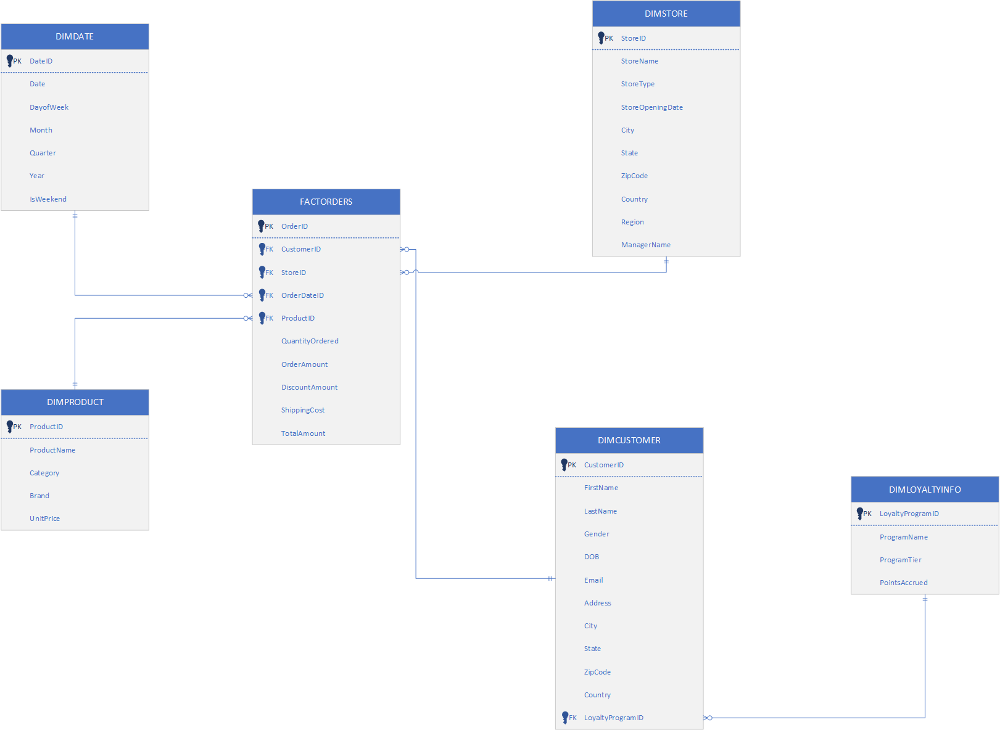

# Retail_DW_Project

## Overview
The project centers around a retail organization that sells thousands of products in many retail stores and has a customer loyalty program. The company would like to store their data in a dimensional model to generate meaningful insights.

The dataset was generated using the Python Faker which was output to CSV files.
The data is moved from local CSV files into Snowflake using SnowSQL. Then, the data is copied into structured tables.

## ER Diagram

## Technologies Used
- Python
- Snowflake
- Power BI

